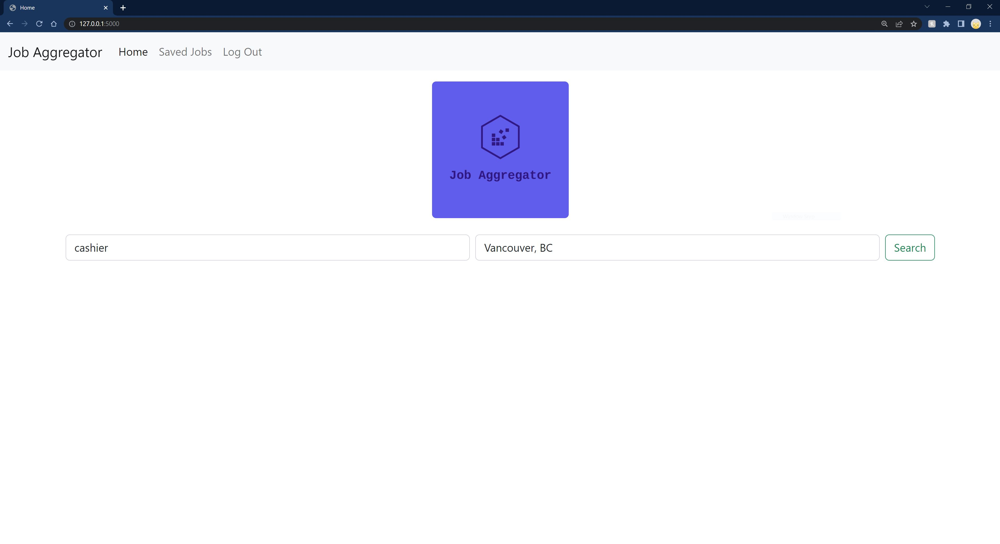
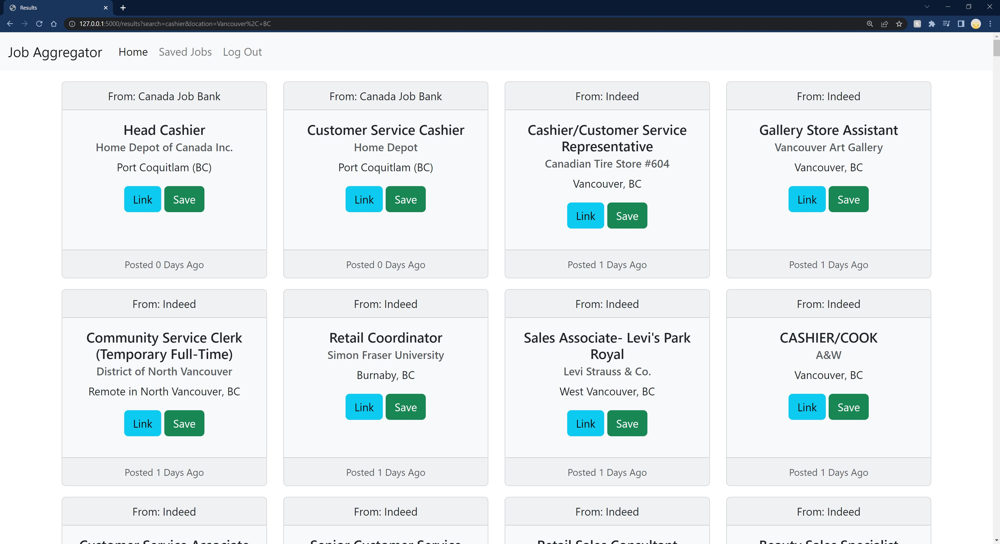

<!-- PROJECT LOGO -->
 

  

<h3 align="center">Job Aggregator</h3>

  

    A web application to assemble all job search results posted on different platforms using web-scrapping.
     
    <a href="https://github.com/hwca96/Job_Aggregator"><strong>Explore the docs »</strong></a>
     
     
    <a href="https://github.com/hwca96/Job_Aggregator">View Demo</a>
    ·
    <a href="https://github.com/hwca96/Job_Aggregator/issues">Report Bug</a>
    ·
    <a href="https://github.com/hwca96/Job_Aggregator/issues">Request Feature</a>
  

<!-- TABLE OF CONTENTS -->

  
Table of Contents

  <ol>
    <li>
      <a href="#about-the-project">About The Project</a>
      <ul>
        <li><a href="#built-with">Built With</a></li>
      </ul>
    </li>
    <li><a href="#roadmap">Roadmap</a></li>
    <li><a href="#contributing">Contributing</a></li>
    <li><a href="#contact">Contact</a></li>
    <li><a href="#acknowledgments">Acknowledgments</a></li>
  </ol>

<!-- ABOUT THE PROJECT -->
## About The Project
<h3>Home Page</h3>

  

<h3>Results Page</h3>

  

This project was inspired by my own stuggles in job search as a student and also from my partner's job as a digital literacy specialist helping new immigrants with the technological hurdles when searching for jobs online.

There are a large number of job search platforms on the internet. Navigating them can be difficult and time consuming. Most jobs are usually only posted on one platfrom so a job seeker must manage multiple websites and accounts to see all the opportunities avaialable online.

Online job search should not a tediou task that requires signing up multiple times and navigating multiple platforms. This web application aims to simplify the job search experience by accumulating job search results from several large platforms and display the most important job information to the user.

Future plans for this site will be to add more job platforms, allow logged in users to save jobs for later, and incorporate company reviews and salary information to further simplify the online job search experience.

(<a href="#top">back to top</a>)

### Built With

* [Python](https://www.python.org/)
* [Flask](https://flask.palletsprojects.com/en/2.1.x/)
* [Flask SQLAlchemy](https://flask-sqlalchemy.palletsprojects.com/en/2.x/)
* [Beautiful Soup (bs4)](https://www.crummy.com/software/BeautifulSoup/bs4/doc/)
* [Bootstrap](https://getbootstrap.com)

(<a href="#top">back to top</a>)

<!-- ROADMAP -->
## Roadmap

- [x] Create web scrapper for Indeed and Canada Job Bank.
- [x] Create website frontend to allow user to search for jobs and display the results.
- [x] Allow user to sign-up, login, and logout.
- [ ] Allow logged-in user to save jobs for later.
- [ ] Incorporate company review information.
- [ ] Incorporate job salary information.
- [ ] Add more job search platforms.

See the [open issues](https://github.com/hwca96/Job_Aggregator/issues) for a full list of proposed features (and known issues).

(<a href="#top">back to top</a>)

<!-- CONTRIBUTING -->
## Contributing

This is my first personal project that I am personally passionate about. I still have alot ot learn and I would love any comments and suggestions about this project.

Contributions are what make the open source community such an amazing place to learn, inspire, and create. Any contributions you make are **greatly appreciated**.

(<a href="#top">back to top</a>)

<!-- CONTACT -->
## Contact

Harvey Wu - hwca96@gmail.com

Project Link: [https://github.com/hwca96/Job_Aggregator](https://github.com/hwca96/Job_Aggregator)

(<a href="#top">back to top</a>)

<!-- ACKNOWLEDGMENTS -->
## Acknowledgments

* [Python Website Full Tutorial - TechWithTim](https://youtu.be/dam0GPOAvVI)
* [Best-README-Template](https://github.com/othneildrew/Best-README-Template)

(<a href="#top">back to top</a>)

<!-- MARKDOWN LINKS & IMAGES -->
<!-- https://www.markdownguide.org/basic-syntax/#reference-style-links -->
[contributors-shield]: https://img.shields.io/github/contributors/github_username/repo_name.svg?style=for-the-badge
[contributors-url]: https://github.com/hwca96/Job_Aggregator/graphs/contributors
[forks-shield]: https://img.shields.io/github/forks/github_username/repo_name.svg?style=for-the-badge
[forks-url]: https://github.com/hwca96/Job_Aggregator/network/members
[stars-shield]: https://img.shields.io/github/stars/github_username/repo_name.svg?style=for-the-badge
[stars-url]: https://github.com/hwca96/Job_Aggregator/stargazers
[issues-shield]: https://img.shields.io/github/issues/github_username/repo_name.svg?style=for-the-badge
[issues-url]: https://github.com/hwca96/Job_Aggregator/issues
[license-shield]: https://img.shields.io/github/license/github_username/repo_name.svg?style=for-the-badge
[license-url]: https://github.com/hwca96/Job_Aggregator/blob/master/LICENSE.txt
[linkedin-shield]: https://img.shields.io/badge/-LinkedIn-black.svg?style=for-the-badge&logo=linkedin&colorB=555
[linkedin-url]: https://linkedin.com/in/linkedin_username
[product-screenshot]: images/screenshot.png